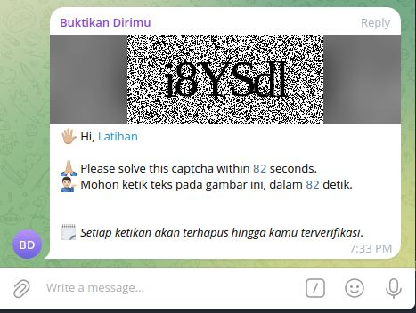

# Telegram Bot - Prove You're Human

A Telegram bot that verifies new group members using an image CAPTCHA. When a user joins a group, all permissions are revoked, so they can only interact via the CAPTCHA buttons. The user must solve the CAPTCHA within a time limit. If the user answers correctly, the bot removes the CAPTCHA message and restores the user's permissions. If the user fails or times out, the bot removes the user from the group.



## Features
- Sends image CAPTCHA to new members.
- CAPTCHA length is configurable via `.env`.
- New members are restricted from sending messages until verified.
- Verification timeout (default 120 seconds) is configurable.
- Caption countdown update interval (default 10 seconds) is configurable.
- Correct answer: CAPTCHA message removed and user permissions restored.
- Wrong answers are cleared; timeout or too many wrong attempts: user is removed.
- Inline buttons for answers, reshuffled after a wrong answer.

## Requirements
- A Telegram bot created via BotFather.
- The bot must be an admin in the group with permissions:
  - Delete messages (to delete CAPTCHA and user messages)
  - Ban users / Restrict members (to restrict and remove users)
  - (Optional) Manage messages if you want the bot to delete join/left messages in all group types

## Running from Release

1) Download the release file for your OS/architecture:
   - `buktikanbot-<version>-x86_64-unknown-linux-gnu.tar.gz`
   - `buktikanbot-<version>-aarch64-unknown-linux-gnu.tar.gz`
   - `buktikanbot-<version>-x86_64-apple-darwin.tar.gz`
   - `buktikanbot-<version>-aarch64-apple-darwin.tar.gz`
   - `buktikanbot-<version>-x86_64-pc-windows-msvc.zip`

2) Extract and run:
   - Linux/macOS:
     ```bash
     tar -xzf buktikanbot-<version>-<target>.tar.gz
     ./buktikanbot
     ```
   - Windows (PowerShell):
     ```powershell
     Expand-Archive -Path buktikanbot-<version>-x86_64-pc-windows-msvc.zip -DestinationPath .
     .\buktikanbot.exe
     ```

## Configuration
Create `.env`:

```env
BOT_TOKEN=your-telegram-bot-token
CAPTCHA_LEN=6
CAPTCHA_TIMEOUT_SECONDS=120
CAPTCHA_CAPTION_UPDATE_SECONDS=10
CAPTCHA_WIDTH=400
CAPTCHA_HEIGHT=100
CAPTCHA_OPTION_COUNT=6
CAPTCHA_ATTEMPTS=3
CAPTCHA_OPTION_DIGITS_TO_EMOJI=true
DELETE_JOIN_MESSAGE=true
DELETE_LEFT_MESSAGE=true
LOG_ENABLED=true
LOG_JSON=false
LOG_LEVEL=info
CAPTCHA_LOG_ENABLED=false
CAPTCHA_LOG_CHAT_ID=
TIMEZONE=Asia/Jakarta
```

Environment variables:
- `BOT_TOKEN`: Telegram bot token.
- `CAPTCHA_LEN`: CAPTCHA text length.
- `CAPTCHA_TIMEOUT_SECONDS`: maximum time to solve.
- `CAPTCHA_CAPTION_UPDATE_SECONDS`: caption countdown update interval (default 10 seconds).
- `CAPTCHA_WIDTH` / `CAPTCHA_HEIGHT`: CAPTCHA image size.
- `CAPTCHA_OPTION_COUNT`: number of answer buttons (default 6).
- `CAPTCHA_ATTEMPTS`: number of attempts (default 3).
- `CAPTCHA_OPTION_DIGITS_TO_EMOJI`: convert digits and A/B on buttons to emoji (A→🅰️, B→🅱️, AB→🆎) (default `true`).
- `DELETE_JOIN_MESSAGE`: delete join messages (default true).
- `DELETE_LEFT_MESSAGE`: delete left messages (default true).
- `LOG_ENABLED`: `true` to enable logs, `false` to disable.
- `LOG_JSON`: `true` for JSON logs, `false` for colored logs.
- `LOG_LEVEL`: `info`, `warn`, or `error` (default `info`).
- `CAPTCHA_LOG_ENABLED`: `true` to send captcha logs to a target chat, `false` to disable (default `false`).
- `CAPTCHA_LOG_CHAT_ID`: target chat/group/channel ID for captcha logs.
- `TIMEZONE`: log timezone (default `Asia/Jakarta`).
- `RUN_MODE`: `polling` (default) or `webhook`.

For webhook mode, see [`WEBHOOK.md`](./WEBHOOK.md).

## Bot Commands (Private)
- `/start`: bot info.
- `/ping`: response time check.
- `/ver`, `/versi`, `/version`: app version info.

## Versioning

Check current version:

```bash
./scripts/version_dump.sh
```

Bump version:

```bash
./scripts/version_bump.sh major
./scripts/version_bump.sh minor
./scripts/version_bump.sh patch
```

## Build from Source (Alternative)

### Prerequisites
- Rust (edition 2024) and Cargo.

### Build and Run

Run directly:

```bash
cargo run
```

Or build release:

```bash
cargo build --release
```

Binary output:

```text
target/release/telegram-buktikanbot
```

Run the built binary:

```bash
./target/release/telegram-buktikanbot
```

## Docker

### Pull Image (GHCR)

```bash
docker pull ghcr.io/banghasan/telegram-buktikanbot:latest
```

Or use a version tag:

```bash
docker pull ghcr.io/banghasan/telegram-buktikanbot:<version>
```

### Docker Compose

1) Fill `.env` and make sure the bot token is set.

2) Run:

```bash
docker compose up -d
```

Override `.env` values at runtime:

```bash
BOT_TOKEN=your-telegram-bot-token CAPTCHA_TIMEOUT_SECONDS=180 CAPTCHA_CAPTION_UPDATE_SECONDS=10 docker compose up -d
```

For webhook mode via Docker Compose, see [`WEBHOOK.md`](./WEBHOOK.md) and the example [`docker-compose.webhook.yml`](./docker-compose.webhook.yml).

## How It Works
1. The bot detects a new member joining a group.
2. The bot sends a CAPTCHA image with inline answer buttons.
3. The user must answer within `CAPTCHA_TIMEOUT_SECONDS`.
4. Correct: bot deletes CAPTCHA message and restores permissions.
5. Wrong too many times or timeout: bot removes the user.

## Notes
- Verification state is kept in memory. A restart clears pending state.
- For security, do not commit `.env` to the repo.
- Ensure the bot has the required admin permissions (see Requirements).
- If you use webhooks behind an SSL proxy (e.g., Cloudflare) and inline buttons do not respond, make sure the `X-Telegram-Bot-Api-Secret-Token` header is forwarded. If you cannot forward it, temporarily unset `WEBHOOK_SECRET_TOKEN`.

## Credit
- Hasanudin H Syafaat @hasanudinhs
- banghasan@gmail.com
- https://banghasan.com

Discussion and support in Telegram group [@botindonesia](https://t.me/botindonesia).
