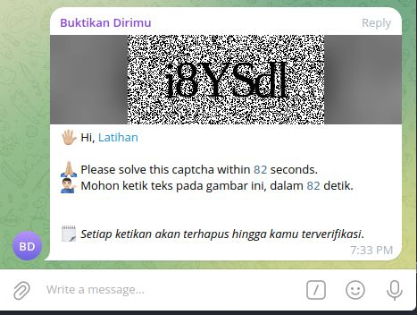

# Telegram Bot - Prove You're Human

A Telegram bot that verifies new group members using an image CAPTCHA. When a user joins a group, all permissions are revoked, so they can only interact via the CAPTCHA buttons. The user must solve the CAPTCHA within a time limit. If the user answers correctly, the bot removes the CAPTCHA message and restores the user's permissions. If the user fails or times out, the bot removes the user from the group.



## Features
- Sends image CAPTCHA to new members.
- CAPTCHA length is configurable via `.env`.
- New members are restricted from sending messages until verified.
- Verification timeout (default 120 seconds) is configurable.
- Caption countdown update interval (default 10 seconds) is configurable.
- Correct answer: CAPTCHA message removed and user permissions restored.
- Wrong answers are cleared; timeout or too many wrong attempts: user is removed.
- Inline buttons for answers, reshuffled after a wrong answer.

## Requirements
- A Telegram bot created via BotFather.
- The bot must be an admin in the group with permissions:
  - Delete messages (to delete CAPTCHA and user messages)
  - Ban users / Restrict members (to restrict and remove users)
  - (Optional) Manage messages if you want the bot to delete join/left messages in all group types

## Running from Release

Version change details are available on the [Release][releases] page.

1) Download the release file for your OS/architecture (pick what matches your system):
   - Linux 64-bit Intel/AMD: `x86_64-unknown-linux-gnu`
   - Linux 64-bit ARM (e.g., ARM servers/Raspberry Pi 64-bit): `aarch64-unknown-linux-gnu`
   - macOS Intel: `x86_64-apple-darwin`
   - macOS Apple Silicon (M1/M2/M3): `aarch64-apple-darwin`
   - Windows 64-bit: `x86_64-pc-windows-msvc` 

   How to check your architecture:
   - Windows (PowerShell): `wmic os get osarchitecture`
   - macOS (Terminal): `uname -m`
   - Linux (Terminal): `uname -m`

2) Extract and run:
   - Linux/macOS:
     ```bash
     tar -xzf buktikanbot-<version>-<target>.tar.gz
     ./buktikanbot
     ```
   - Windows (PowerShell):
     ```powershell
     Expand-Archive -Path buktikanbot-<version>-x86_64-pc-windows-msvc.zip -DestinationPath .
     .\buktikanbot.exe
     ```

## Configuration
Copy `.env.example` to `.env` first, then fill the values:
- Linux/macOS (Terminal): `cp .env.example .env`
- Windows (PowerShell): `Copy-Item .env.example .env`
The `.env.example` file is in the repo root.

```env
BOT_TOKEN=your-telegram-bot-token
CAPTCHA_LEN=6
CAPTCHA_TIMEOUT_SECONDS=120
CAPTCHA_CAPTION_UPDATE_SECONDS=10
CAPTCHA_WIDTH=320
CAPTCHA_HEIGHT=100
CAPTCHA_OPTION_COUNT=6
CAPTCHA_ATTEMPTS=3
CAPTCHA_OPTION_DIGITS_TO_EMOJI=true
DELETE_JOIN_MESSAGE=true
DELETE_LEFT_MESSAGE=true
BAN_RELEASE_ENABLED=false
BAN_RELEASE_AFTER_SECONDS=14400
BAN_RELEASE_DB_PATH=buktikan.sqlite
LOG_ENABLED=true
LOG_JSON=false
LOG_LEVEL=info
CAPTCHA_LOG_ENABLED=false
CAPTCHA_LOG_CHAT_ID=
CAPTCHA_LOG_MESSAGE_THREAD_ID=
TIMEZONE=Asia/Jakarta
```

Environment variables:
- `BOT_TOKEN`: Telegram bot token.
- `CAPTCHA_LEN`: CAPTCHA text length.
- `CAPTCHA_TIMEOUT_SECONDS`: maximum time to solve.
- `CAPTCHA_CAPTION_UPDATE_SECONDS`: caption countdown update interval (default 10 seconds).
- `CAPTCHA_WIDTH` / `CAPTCHA_HEIGHT`: CAPTCHA image size (effective values capped at 399x299 due to library limits).
- `CAPTCHA_OPTION_COUNT`: number of answer buttons (default 6).
- `CAPTCHA_ATTEMPTS`: number of attempts (default 3).
- `CAPTCHA_OPTION_DIGITS_TO_EMOJI`: convert digits and A/B on buttons to emoji (A→🅰️, B→🅱️, AB→🆎) (default `true`).
- `DELETE_JOIN_MESSAGE`: delete join messages (default true).
- `DELETE_LEFT_MESSAGE`: delete left messages (default true).
- `BAN_RELEASE_ENABLED`: `true` to auto-unban users after a kick/ban, `false` to disable (default `false`).
- `BAN_RELEASE_AFTER_SECONDS`: delay before auto-unban (default 14400 = 4 hours).
- `BAN_RELEASE_DB_PATH`: SQLite database path for CAPTCHA state and auto-unban schedule (default `buktikan.sqlite`; Docker Compose maps it to `/data/buktikan.sqlite`).
- `LOG_ENABLED`: `true` to enable logs, `false` to disable.
- `LOG_JSON`: `true` for JSON logs, `false` for colored logs.
- `LOG_LEVEL`: `info`, `warn`, or `error` (default `info`).
- `CAPTCHA_LOG_ENABLED`: `true` to send captcha logs to a target chat, `false` to disable (default `false`).
- `CAPTCHA_LOG_CHAT_ID`: target chat/group/channel ID for captcha logs.
- `CAPTCHA_LOG_MESSAGE_THREAD_ID`: optional forum topic/thread ID for captcha and ban-release logs. If empty, logs go to the chat/general topic.
- `TIMEZONE`: log timezone (default `Asia/Jakarta`).
- `RUN_MODE`: `polling` (default) or `webhook`.

Captcha logs include the status, event time, user and chat identity, Telegram IDs,
attempt count, failure reason, and ban action. When a temporary ban is scheduled,
the automatic release time is included as well. A ban-release log replies to its
related failure log. If the parent message is unavailable or belongs to an older
record, the bot sends the release log as a regular message.

The Rust toolchain is pinned to `1.98.1` through `rust-toolchain.toml` so local
builds, CI, and releases use the same version.

For webhook mode, see [`WEBHOOK.md`](./WEBHOOK.md).

Docker note: if you use the Docker image, the sample env file is located at
`/usr/local/share/telegram-buktikanbot/.env.example`.

### Docker Permission Note (/data)
The container runs as non-root (`appuser`, uid `10001`). If you bind-mount a host folder to `/data`, make sure it is writable by uid `10001`, for example:

```bash
mkdir -p ./data
sudo chown 10001:10001 ./data
```
Alternatively (less secure), run the container as root with `user: "0:0"` in `docker-compose.yml`.

## Bot Commands (Private)
- `/start`: bot info.
- `/ping`: response time check.
- `/ver`, `/versi`, `/version`: app version info.

## Versioning

Version change details are available on the [Release][releases] page.

Check current version:

```bash
./scripts/version_dump.sh
```

Bump version:

```bash
./scripts/version_bump.sh major
./scripts/version_bump.sh minor
./scripts/version_bump.sh patch
```

## Build from Source (Alternative)

See the full guide in [BUILD_FROM_SOURCE.en.md](BUILD_FROM_SOURCE.en.md).

## Pull Request Checks

Every Pull Request runs automated checks through GitHub Actions:

- formatting with `cargo fmt`;
- unit tests with `cargo test --locked`;
- linting with `cargo clippy --locked --all-targets -- -D warnings`.

The workflow does not run on ordinary pushes.

## Docker

### Pull Image (GHCR)

```bash
docker pull ghcr.io/banghasan/telegram-buktikanbot:<version>
```

Use an explicit version tag so the deployed image is reproducible.

### Docker Compose

1) Fill `.env` and make sure the bot token is set.

Compose uses a fixed version tag so deployments are reproducible. When upgrading,
set `BOT_IMAGE` to the version tag you want to deploy.

2) Run:

```bash
docker compose up -d
```

Example image upgrade:

```bash
BOT_IMAGE=ghcr.io/banghasan/telegram-buktikanbot:1.9.3 docker compose up -d
```

Override `.env` values at runtime:

```bash
BOT_TOKEN=your-telegram-bot-token CAPTCHA_TIMEOUT_SECONDS=180 CAPTCHA_CAPTION_UPDATE_SECONDS=10 docker compose up -d
```

For webhook mode via Docker Compose, see [`WEBHOOK.md`](./WEBHOOK.md) and the example [`docker-compose.webhook.yml`](./docker-compose.webhook.yml).

## How It Works
1. The bot detects a new member joining a group.
2. The bot sends a CAPTCHA image with inline answer buttons.
3. The user must answer within `CAPTCHA_TIMEOUT_SECONDS`.
4. Correct: bot deletes CAPTCHA message and restores permissions.
5. Wrong too many times or timeout: bot removes the user.

## Notes
- CAPTCHA state is persisted in SQLite. After a restart, active sessions are reconciled and a fresh CAPTCHA is sent; the user remains restricted during recovery.
- When `BAN_RELEASE_ENABLED=true`, bans use Telegram's `until_date` and are also recorded in SQLite. `until_date` provides automatic expiry if the worker or container stops.
- For security, do not commit `.env` to the repo.
- Ensure the bot has the required admin permissions (see Requirements).
- If you use webhooks behind an SSL proxy (e.g., Cloudflare) and inline buttons do not respond, make sure the `X-Telegram-Bot-Api-Secret-Token` header is forwarded. If you cannot forward it, temporarily unset `WEBHOOK_SECRET_TOKEN`.

## Credit
- Hasanudin H Syafaat @hasanudinhs
- banghasan@gmail.com
- https://banghasan.com

Discussion and support in Telegram group [@botindonesia](https://t.me/botindonesia).

[releases]: https://github.com/banghasan/telegram-buktikanbot/releases
